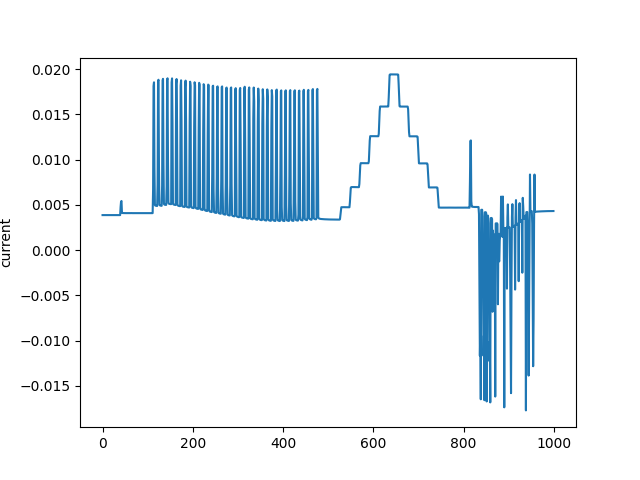

Sure, here's the updated `README.md` file for you to copy:

LAAS-LAPLACE Hackathon Test Bench
==================================

This repository contains the code for the LAAS-LAPLACE Hackathon Test Bench. The test bench is composed of digital multimeters, an oscilloscope, a power supply, a device under test (DUT: two half bridges in opposition) and a PWM generator (SPIN Board).

A supervisor has been written `Supervisor_v1_2.py` which will do the test sequence:
1) Config microcontroller and turn ON gate signal
2) Start logging DC current at DMM
3) Sweep DC bus Voltage (ramp up)
4) Sweep Phase Shift generated by microcontroller (ramp up and down)
5) Ramp down DC bus Voltage
6) Read Buffer of DMM
7) Plot and export data in .csv with timestamp
8) Return to initial state


*Video: Demo - Python Supervisor v1.2*
<video src="https://github.com/user-attachments/assets/0cd5cf06-7bd1-42ec-848b-38305e3359d9" width="360" height="480" controls></video>

Typical DC current measurement during sweep is:
*Image : DC current at HV bus: power supply turn ON, DC bus ramp up (75 V), Phase shift sweep, DC bus ramp down, power supply turn OFF*



Previous functions such as `main.py` script creates all the objects of each instrument of the test bench and provides multiple code functions for later developing the appropriate algorithm.

Requirements
------------

* Python 3.x
* PyVISA
* pandas
* matplotlib

SPIN board must be loaded with v1.0.0-rc-power_tuesday branch
* The python files with key functions for SPIN must be copied in the "comm_protocol" folder
* > The folder is located in the cloned GIT repo. at owntech\lib\USB\comm_protocol
* > The folder is also provided here in `comm_protocol`
* The DMM used is SDM3065 from Siglent
* The power supply used is Z650+ from TDK Lambda
* Use any other equipment and adapt the SCPI commands, if needed
* Do not forget to add the address of DMM and powersupply!!!! Can use def `list_instruments()`: if needed


Getting Started
---------------

1. Clone the repository to your local machine:
```bash
git clone https://github.com/your_username/laas-laplace-hackathon.git
```
2. Install the required packages:
```bash
pip install -r requirements.txt
```
3. Connect your instruments to your computer and make sure they are recognized by PyVISA:
```bash
python -m pyvisa.info
```
4. Run the `Supervisor_v1_2.py` or `main.py` script:
```bash
python Supervisor_v1_2.py
```
or 
```bash
python main.py
```
Instruments
------------

### Digital Multimeters

The digital multimeters are used to measure the voltage, current and temperature of the DUT. The `measure_devices_init()` function initializes the multimeters and checks their identity.

### Power Supply

The power supply is used to provide power to the DUT. The `supply_init()` function initializes the power supply and sets up the channels.

### Oscilloscope

The oscilloscope is used to visualize the waveforms of the DUT. The `Oscilloscope` class provides methods to configure the scope, acquire data and save it to a CSV file.

### Device Under Test (DUT)

The DUT is the device being tested in the LAAS-LAPLACE Hackathon. The `Twist_Device` class provides methods to control the DUT and acquire data.

Contributing
------------

Any contribution is welcome through PRs.

License
-------

All the code is in GPLV3.
